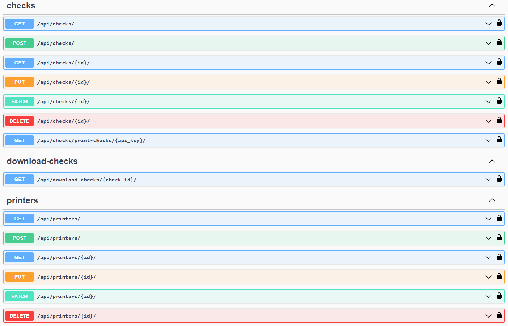
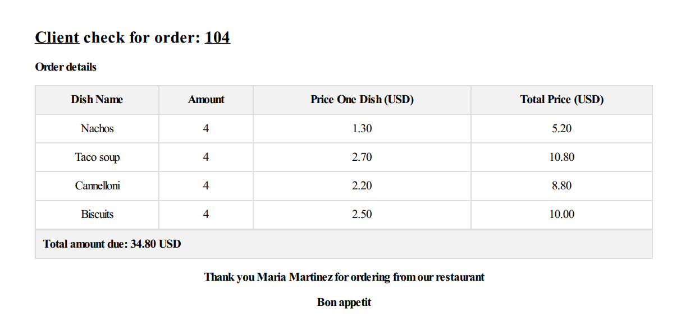

## Check Generation Service.

### Description.

API to create & generate PDF files for each check order.

### Installation.

**NOTE**: Python3 must be already installed.

```shell
git clone https://github.com/Vasyl-Poremchuk/check-generation-service
cd check_generation_service
python -m venv venv
venv\Scripts\activate (Windows) or sourse venv/bin/activate (Linux or macOS)
pip install -r requirements.txt
```

**NOTE**: Before running the program, you must create an **.env** file and fill it using the template in the **.env.sample** file.

### Running the application on the local machine

**NOTE**: If you are using a **Windows** operating system, you should install **psycopg2** instead of the **psycopg2-binary** package:

```shell
pip install psycopg2
```

#### Apply database migrations:

```shell
python manage.py migrate
```

#### Load data from fixture files:

```shell
python manage.py loaddata check_service/fixtures/printer_data.json check_service/fixtures/check_data.json
```

#### Start the server:

```shell
python manage.py runserver
```

#### Start a Redis container:

```shell
docker run -d -p 6379:6379 redis
```

#### Before running the Celery task, you should install wkhtmltopdf on your local machine.

Use the following  link [WKHTMLTOPDF](https://wkhtmltopdf.org/downloads.html) & download the appropriate program depending on your operating system.

Then, from the folder where the program is installed (for instance: "C:\Program Files\wkhtmltopdf\bin\wkhtmltopdf.exe"), copy the file **wkhtmltopdf.exe** and move it to the root folder of the project.

#### Start a Celery worker, that runs task:

```shell
celery -A check_generation_service worker -l INFO
```

**NOTE**: If you are using a **Windows** operating system, you should install a **gevent** package:

```shell
pip install gevent
```

#### And start celery as follows:

```shell
celery -A check_generation_service worker -l INFO -P gevent
```

#### Start a Celery beat process that schedules periodic task:

```shell
celery -A check_generation_service beat -l INFO --scheduler django_celery_beat.schedulers:DatabaseScheduler
```

#### You can use the admin site to check all available printers & checks, as well as periodic tasks. To do this, you should navigate to the next endpoint [URL](http://127.0.0.1:8000/admin/login/?next=/admin/) using the following credentials:

```
Username: test_user
Password: testpassword
```

#### To run the tests, you can run the following command:

```shell
python manage.py test
```

### Running the application from a Dockerfile.

#### Build the Docker image & start a group of Docker containers:

```shell
docker-compose up --build
```

#### Create admin user & create schedule for running task.

#### You will then be able to see all available tasks using the following endpoint [FLOWER](http://127.0.0.1:5555).

### Available endpoints.

#### All available endpoints can be checked on the next endpoint [SWAGGER](http://127.0.0.1:8000/api/schema/swagger/#/).



#### If the check is available for download, you can download it by moving to the next endpoint: **http://127.0.0.1:8000/api/download-checks/{check_id}/** & clicking the download button.


